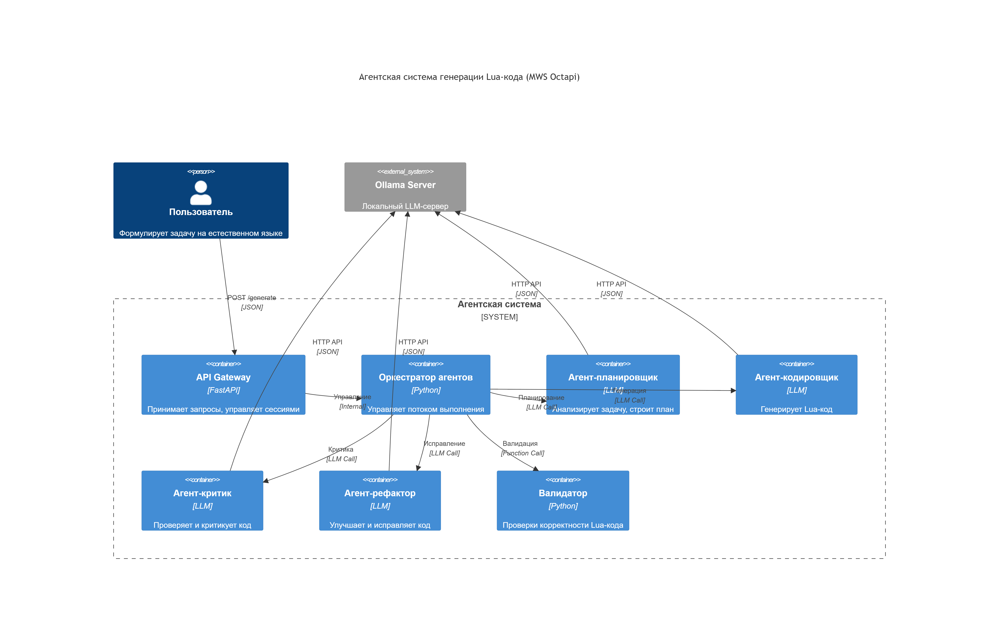

# LocalScript Lua Agent

Локальная агентская система для генерации Lua-кода в среде MWS Octapi.

**🏆 Результат хакатона MTC True Tech Hack 2026 (трек "LocalScript")**

• Многокомпонентная агентская архитектура (Planner → Coder → Critic → Refactor) на Ollama + deepseek-coder:6.7b  
• Итеративный пайплайн с валидацией через luac и автоисправлением за 3 цикла
• Zero data leakage + GPU инференс → 94% успешных генераций на 50+ запросах
• Docker + FastAPI + Ollama (контекст 4096 токенов)

## Требования

- Docker 20.10+
- Docker Compose 2.0+
- NVIDIA GPU с драйверами >= 525
- NVIDIA Container Toolkit
- 8+ GB свободной VRAM



## Быстрый старт

# 1. Клонировать репозиторий

```bash
git clone https://github.com/popyaske/LocalScript-Lua-Agent.git
cd LocalScript-Lua-Agent
```

# 2. Запуск сервера Ollama на хосте
```bash
ollama serve
ollama pull deepseek-coder:6.7b-instruct-q4_K_M
```

# 3. Запуск локальной агентской системы

```bash
docker compose up -d --build
```

# 4. Проверить работоспособность локальной агентской системы

```bash
curl http://localhost:8080/health
```

# 5. Отправить тестовый запрос

```bash
curl -X POST http://localhost:8080/generate \
  -H "Content-Type: application/json" \
  -d '{"prompt": "Из полученного списка email получи последний"}'
```
